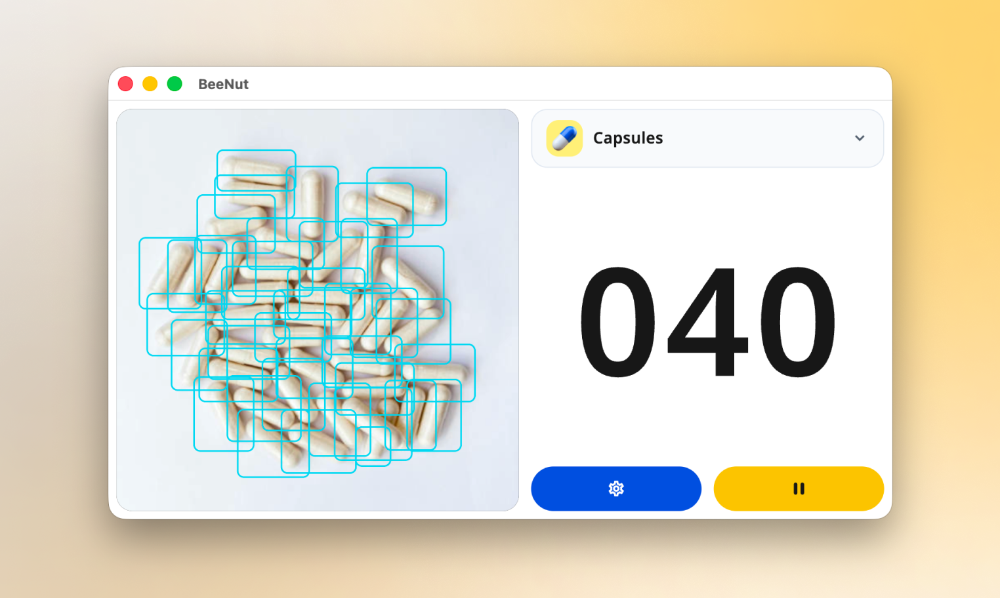

# BeeNut

<p align="center">
  
</p>

<p align="center">
  <a href="https://github.com/mengsokool/app.beenut/actions/workflows/flutter.yml"></a>
  <a href="https://github.com/mengsokool/app.beenut/actions/workflows/release.yml"></a>
  <a href="LICENSE"></a>
</p>

<p align="center">
  <strong>A clean computer-vision counting kiosk for custom YOLO models.</strong><br>
  Flutter operator UI, native GStreamer preview, ONNX Runtime inference, GPIO control, and appliance deployment in one open-source stack.
</p>

---

## What It Does

BeeNut turns a desktop machine, Raspberry Pi, or SBC into a dedicated object-counting appliance. Drop in a YOLO ONNX model, map its labels to targets, and the kiosk handles live preview, bounding boxes, stable counts, settings, diagnostics, and hardware control.

| Layer | What BeeNut Handles |
| --- | --- |
| Operator UI | Touch-friendly Flutter kiosk, target selection, settings, diagnostics, and preview inspection. |
| Native service | `beenutd` manages camera capture, preview transport, inference, counting, GPIO, and shutdown. |
| Model runtime | Bring-your-own YOLO ONNX models, optional labels files, confidence thresholds, and hot-reloaded config. |
| Deployment | macOS app bundles, Linux `.deb` packages, Raspberry Pi appliance mode, and recovery tooling. |

## Highlights

- Live native preview through shared memory, DMA-BUF, or IOSurface transport.
- ONNX Runtime inference for custom YOLO object-detection models.
- Stable gated counting with confidence filters and temporal smoothing.
- Touch-first kiosk UI with theme, model, camera, GPIO, and target catalog settings.
- Raspberry Pi GPIO support with mock fallbacks for local development.
- Release packaging for macOS, Linux desktop, and Raspberry Pi appliance installs.
- Field diagnostics, validation scripts, release manifests, and checksum evidence.

## Download

Prebuilt packages are published on the [GitHub Releases page](https://github.com/mengsokool/app.beenut/releases).

| Platform | Artifact | Use It When |
| --- | --- | --- |
| Raspberry Pi / Debian ARM64 | `beenut_*_arm64.deb` | You want a Pi or SBC to boot into the BeeNut kiosk. |
| Linux desktop AMD64 | `beenut_*_amd64.deb` | You want to install BeeNut on a normal Linux workstation. |
| macOS installer | `BeeNut-macos-*.dmg` | You want the standard drag-to-Applications installer. |
| macOS app bundle | `BeeNut-macos-*.app.zip` | You want a zipped `.app` bundle. |
| Linux bootstrapper | `install-linux.sh` | You want a one-command install from GitHub Releases. |

Release assets include `checksums.sha256` and a JSON release manifest for field verification.

## Quick Install

Linux and Raspberry Pi OS users can install the latest release with:

```bash
curl -fsSL https://raw.githubusercontent.com/mengsokool/app.beenut/master/scripts/install-linux.sh | sudo bash
```

Install a specific release or profile:

```bash
curl -fsSL https://raw.githubusercontent.com/mengsokool/app.beenut/master/scripts/install-linux.sh \
  | sudo env BEENUT_VERSION=v0 BEENUT_PROFILE=appliance-pi bash
```

Available install profiles:

| Profile | Behavior |
| --- | --- |
| `appliance-pi` | Raspberry Pi kiosk using the `flutter-pi` runtime. |
| `appliance-linux` | Generic Linux kiosk using the Flutter Linux bundle. |
| `desktop` | Desktop app install without taking over boot. |
| `dev-service` | Backend service only for development or diagnostics. |

The Linux installer is idempotent: running it again downloads the matching release package, verifies `checksums.sha256`, lets `apt` upgrade or repair the installed package, then reapplies the selected setup profile.

> Appliance profiles intentionally take over boot. If a VM or device returns to a black screen, SSH in and run `sudo beenut-setup --recover-desktop` or `sudo beenut-recover-desktop`.

## Architecture

BeeNut keeps the performance-sensitive media path native. Flutter renders the operator experience and receives lightweight metadata plus a native preview texture.

```text
camera source
  -> GStreamer pipeline (native)
      -> preview branch: shared memory / DMA-BUF / IOSurface
      -> AI branch: sampled RGB frames
          -> ONNX Runtime YOLO engine -> NMS -> counts and boxes
      -> hardware branch: tray sensor and light relay

  [JSON-lines control protocol over Unix socket]

Flutter UI
  -> kiosk/counting interface
  -> settings and diagnostics
  -> native preview texture
```

## Custom Models

BeeNut does not bundle sample model weights. Add your own YOLO ONNX model from settings or place it under:

```text
service/models/<model-name>/
```

Minimum:

```text
service/models/my-model/
└─ yolo.onnx
```

Recommended when the ONNX file does not include class names:

```text
service/models/my-model/
├─ yolo.onnx
└─ labels.txt
```

BeeNut first reads class names from ONNX metadata. If none are available, it falls back to `labels.txt` next to the model. The backend reloads compatible model and label configuration without rebuilding the app.

## Build From Source

### macOS Development

```bash
brew install pkg-config qt gstreamer gst-plugins-base gst-plugins-good gst-plugins-bad onnxruntime
source scripts/dev-env.sh
scripts/prepare-gst-dev.sh
scripts/build-service.sh
flutter test
flutter run
```

Build a release `.app`:

```bash
scripts/build-macos.sh
```

### Linux `.deb`

Build a Debian package after producing a Flutter Linux bundle and `beenutd`:

```bash
BEENUT_PACKAGE_PROFILE=desktop \
BEENUT_KIOSK_MODE=linux \
BEENUT_ARCH=amd64 \
BEENUTD_BIN=service/build/src/beenutd/beenutd \
FLUTTER_LINUX_BUNDLE_DIR=build/linux/x64/release/bundle \
scripts/build-debian.sh
```

Raspberry Pi appliance builds use the `appliance-pi` profile and a `flutter-pi` bundle:

```bash
BEENUT_PACKAGE_PROFILE=appliance-pi \
BEENUT_KIOSK_MODE=flutter-pi \
BEENUT_ARCH=arm64 \
FLUTTER_PI_BUNDLE_DIR=/path/to/flutter-pi/bundle \
BEENUTD_BIN=service/build/src/beenutd/beenutd \
scripts/build-debian.sh
```

## Validation

Run local checks before publishing:

```bash
flutter analyze
flutter test
scripts/validate-phase-gates.sh --dev-only
```

On target hardware, collect field evidence:

```bash
sudo /opt/beenut/scripts/pi-field-validation.sh \
  --operator "QA station 1" \
  --confirm-boot-preview
```

## Documentation

- [OpenWiki quickstart](openwiki/quickstart.md)
- [Architecture and IPC](openwiki/architecture.md)
- [Domain concepts and YOLO engine](openwiki/domain_concepts.md)
- [Hardware and OS integrations](openwiki/integrations.md)
- [Operations, build, and deployment](openwiki/operations.md)
- [Architecture & Design Guide](docs/ARCHITECTURE.md)
- [Deployment & Validation Guide](docs/DEPLOYMENT.md)

## Releases

Tagged releases are built by [`.github/workflows/release.yml`](.github/workflows/release.yml). Push a tag:

```bash
git tag v0
git push origin v0
```

The workflow publishes package artifacts, checksums, the Linux installer script, and a release manifest. Raspberry Pi ARM64 packages can also be built on Pi hardware or a self-hosted ARM64 runner and uploaded to the same release.

## Contributing

Issues, bug reports, and pull requests are welcome. Start with [CONTRIBUTING.md](CONTRIBUTING.md), then open an issue using the GitHub issue templates.

## License

BeeNut is released under the [MIT License](LICENSE).
